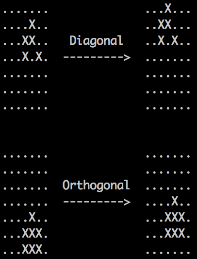

## Spaceship

An attempt at finding spaceships with Sentient for Conway's Game of Life.

The compilation stage starts to choke quickly as the grid size increases or the
number of generations increases. This is due to a limitation on Node's
`JSON.stringify` function, which doesn't allow for strings larger than 256MB in
length. I hope to fix this so that I can search for larger spaceships with the
power of the finest SAT solvers in the land.

## Dependencies

- Sentient (http://sentient-lang.org/)
- Ruby (http://ruby-lang.org/)
- Riss Coprocessor (http://sentient-lang.org/solvers/riss)

The coprocessor is needed for optimisation which can be optionally skipped.

## How to run

```bash
# compile
sentient -c -o spaceship.snt > spaceship.json

# run
sentient -r -n 0 spaceship.json | ruby print.rb
```

## Screenshot


